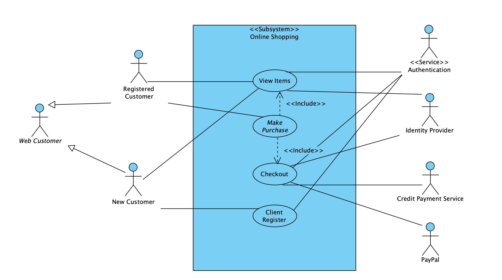
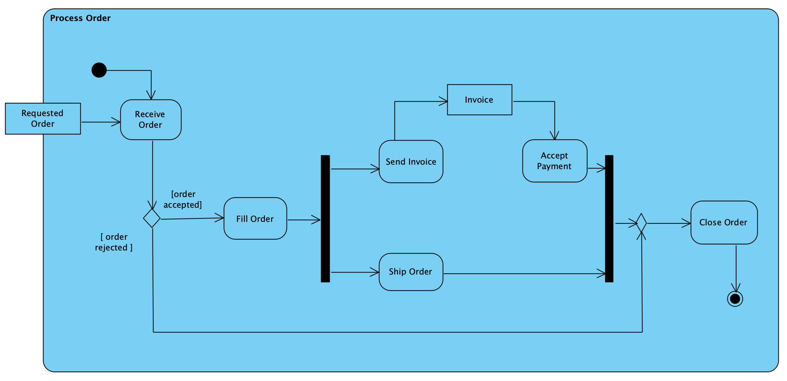
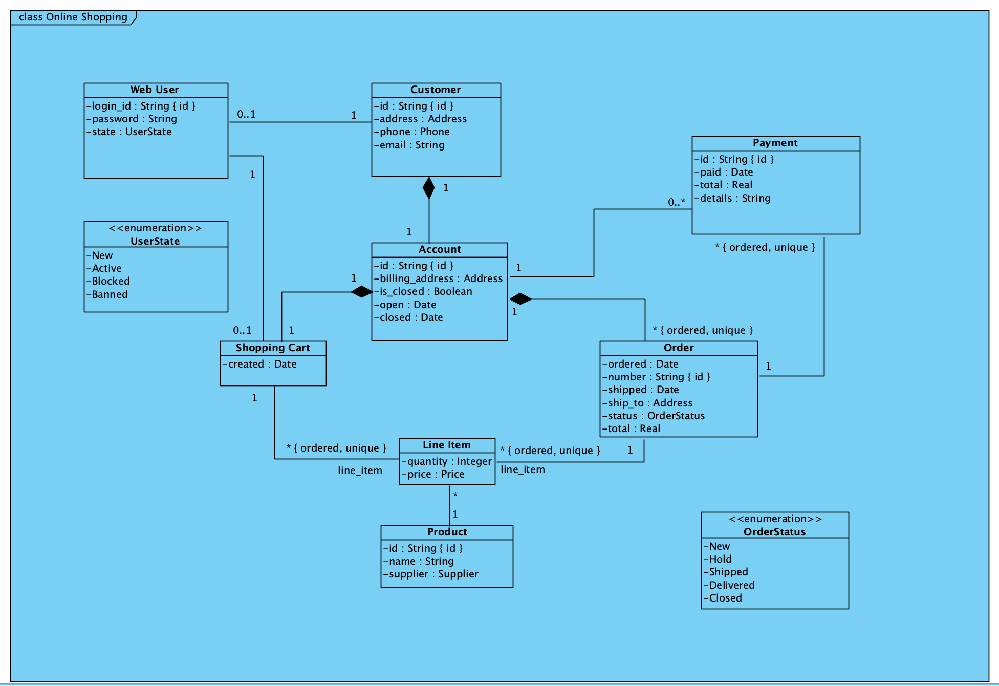
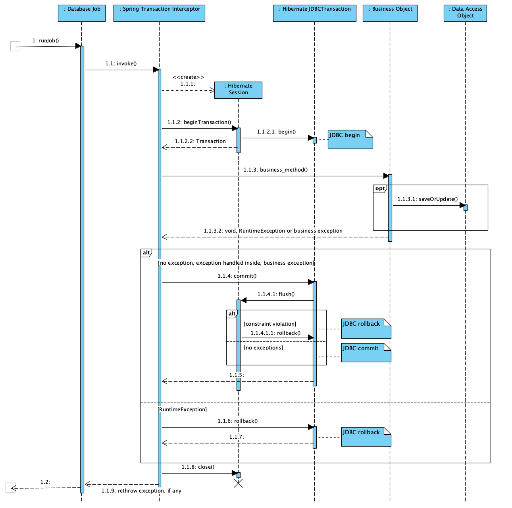
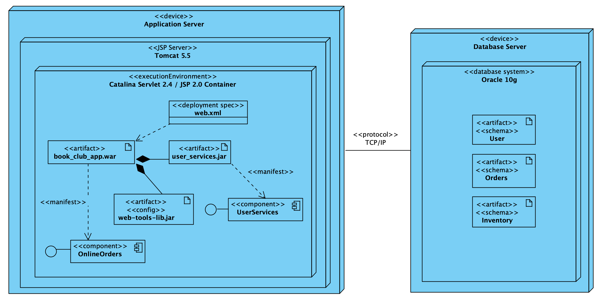

# Labwork 2 : UML : Основы работы в Visual Paradigm CE;

*Выполнил: Де Джофрой Мишель M3308*

## Диаграмма использования (Use Case Diagram)

## Диаграмма деятельности (Activity Diagram)

## Диаграмма классов (Class Diagram)

## Диаграмма последовательности (Sequence Diagram)

## Диаграмма размещения (Deployment Diagram)
